# Procesverslag
Markdown is een simpele manier om HTML te schrijven.  
Markdown cheat cheet: [Hulp bij het schrijven van Markdown](https://github.com/adam-p/markdown-here/wiki/Markdown-Cheatsheet).

Nb. De standaardstructuur en de spartaanse opmaak van de README.md zijn helemaal prima. Het gaat om de inhoud van je procesverslag. Besteedt de tijd voor pracht en praal aan je website.

Nb. Door *open* toe te voegen aan een *details* element kun je deze standaard open zetten. Fijn om dat steeds voor de relevante stuk(ken) te doen.

## Jij

  
uitwerken voor kick-off werkgroep

  ### Auteur:
  Ziyun Ouyang (vervangen door jouw naam)

  #### Je startniveau:
  blauw (kies uit zwart, rood óf blauw)

  #### Je focus:
  surface plane (kies uit responsive óf surface plane)
 

## Je website

  
uitwerken voor kick-off werkgroep

  ### Je opdracht:
  Ziggo/ homepagina: achtergrond van kleur veranderen bij het kiezen van genre
  #### Screenshot(s) van de eerste pagina (small screen): 
  homepage
  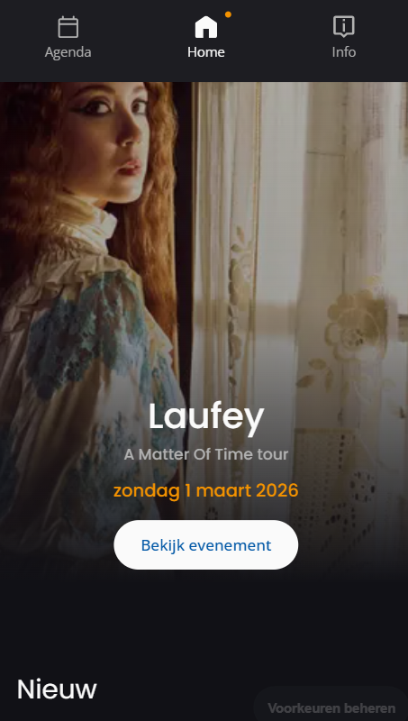

  #### Screenshot(s) van de tweede pagina (small screen):
Agenda page
  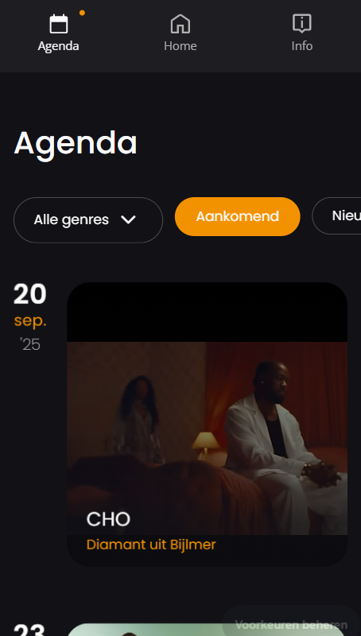
 
 Website: https://www.ziggodome.nl/

## Toegankelijkheidstest 1/2 (week 1)

  
uitwerken na test in 2e werkgroep

  ### Bevindingen
  Lijst met je bevindingen die in de test naar voren kwamen:
1.Kopniveau's:
-Er is geen heading 1 aanwezig, het begint direct bij heading 2.
-Als je probeert naar verschillende koppen te navigeren, slaat de screenreader sommige headings over, omdat deze volgens de screenreader niet bestaan.
-Klik je bijvoorbeeld op een heading 3, dan wordt je doorgestuurd naar "Uitgelicht". Klik je opnieuw, dan verschuift het terug naar de vorige kop. ("3" toets)
-Heading 4 toont informatie over concerten, maar je wordt er niet naartoe geleid.
-Heading 5 en 6 zijn niet aanwezig.

2.Navigatieproblemen:
-De "K" toets springt naar "Bekijk evenement". Naar het einde van de pagina verspringt het naar de footer, waar de agenda start en het rijtje met iconen eindigt bij "Accessibility". (bodem van de footer)
-Na "Accessibility" stopt de screenreader, in plaats van opnieuw alle links af te gaan. 
-Gebruik je de pijl omhoog, dan werkt het wel correct.
-Met "K" + spatie” ga je naar de volgende link. Bijvoorbeeld: bij "Lees meer" en spatie kom je bij "Meer info over merchandise". Dit geldt ook voor artiesten, maar -tickets kan je bijvoorbeeld niet selecteren.

3.Ticket navigatie:
-Je kunt naar alle beschikbare links gaan, behalve het selecteren van tickets.
-Het nadeel is dat je ze allemaal moet afgaan er is geen optie om direct een specifieke ticket te selecteren.

Kortom: de pagina heeft problemen met kopstructuur en screenreader navigatie, waardoor sommige onderdelen niet goed bereikbaar zijn of verwarrend werken.

Bij het checken van de Ziggo Dome-website volgens de WCAG-richtlijnen valt het op:
Tekst & content: Over het algemeen goed, de teksten zijn duidelijk en netjes opgebouwd.
Mobiel & touch: Werkt grotendeels prima op je telefoon of tablet, navigeren gaat soepel.
Afbeeldingen: Hier klopt het niet helemaal: bijvoorbeeld er is vaak geen duidelijke alt-tekst, wat voor mensen met schermlezers lastig kan zijn.
Lijsten: Ze gebruiken bijna geen echte lijst elementen (ul of ol), waardoor het voor sommige gebruikers minder overzichtelijk is.

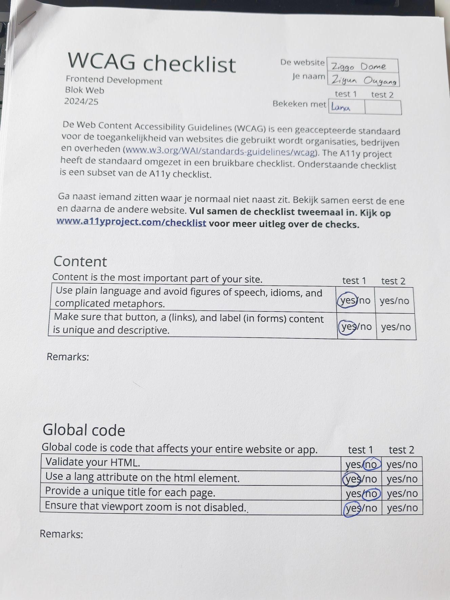
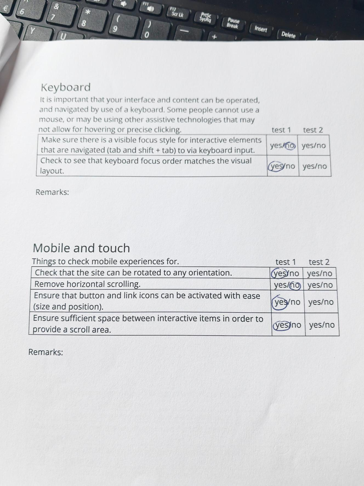
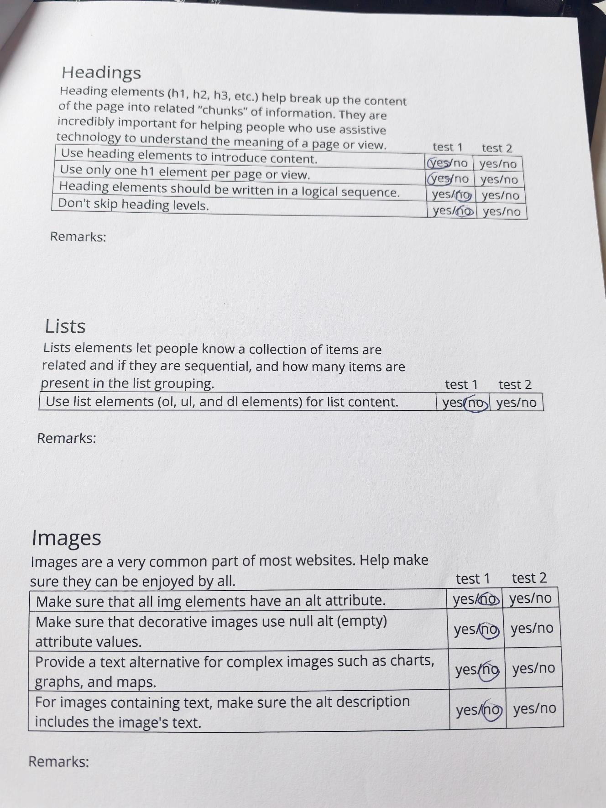
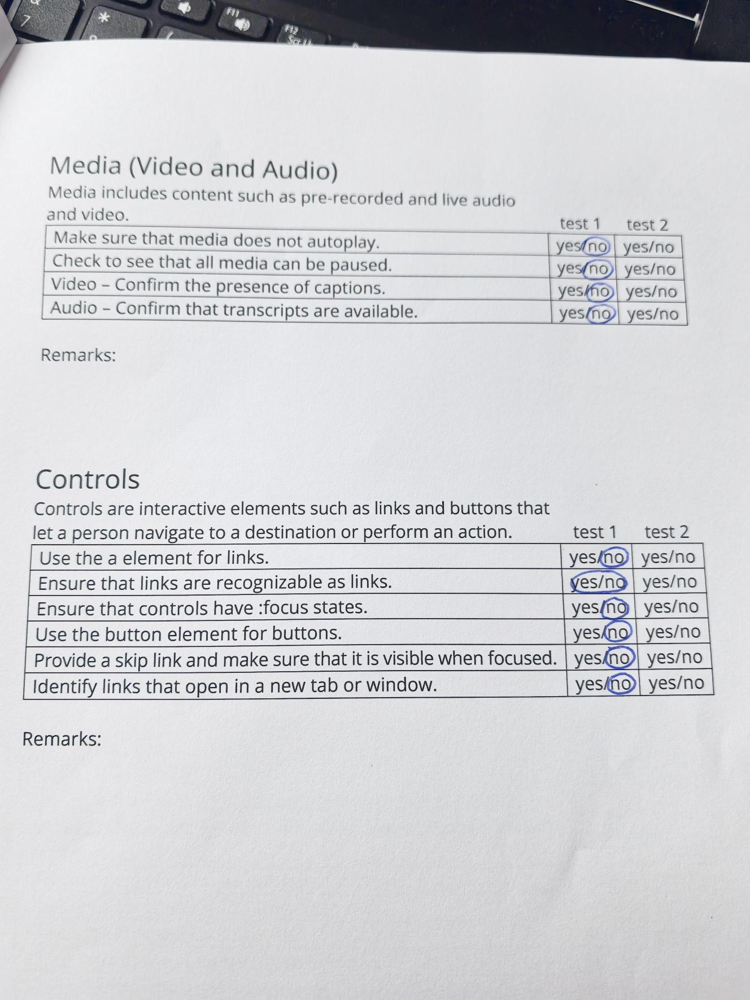
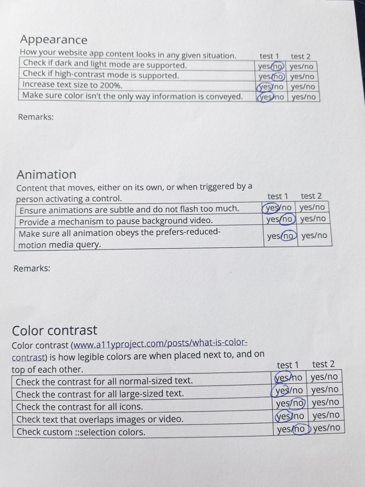

## Breakdownschets (week 1)

  
uitwerken na afloop 3e werkgroep

  ### de hele pagina: 
  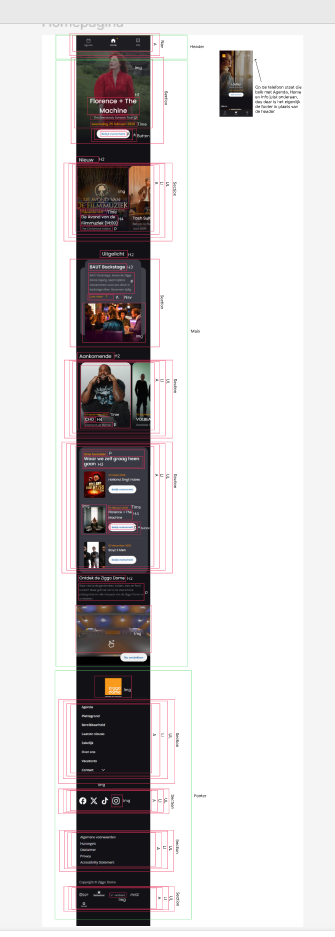
   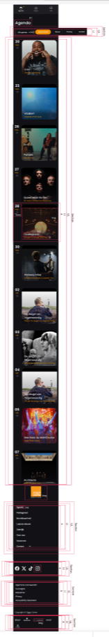

  ### dynamisch deel (bijv menu): 
  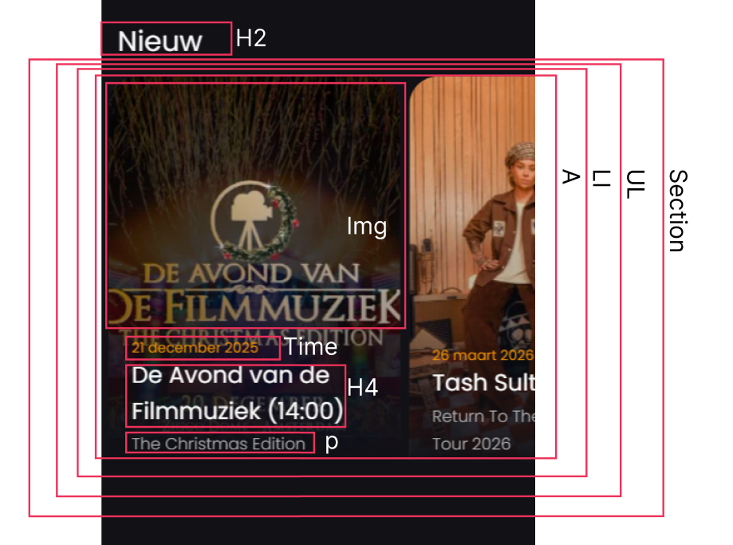

  ### wellicht nog een dynamisch deel (bijv filter): 
  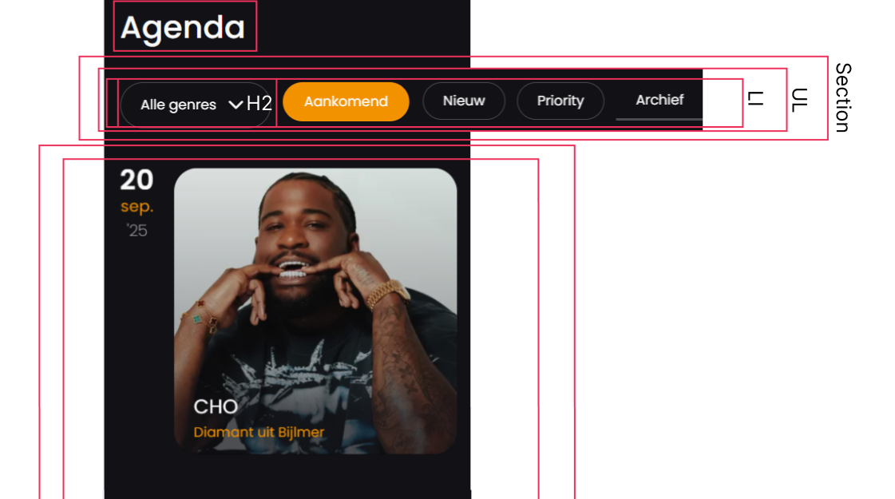

## Voortgang 1 (week 2)

  
uitwerken voor 1e voortgang

  ### Stand van zaken
  Wat goed ging:
Voor mij ging het maken van de breakdownschetsen goed. Ik vond het fijn om eerst visueel te bedenken hoe de website eruit zou zien en hoe de onderdelen zich tot elkaar verhouden. Dit gaf me een duidelijk overzicht en maakte het daarna makkelijker om met de code te werken.

Wat lastig was:
Het opzetten van de HTML vond ik lastig, vooral het structureren van de verschillende pagina’s en zorgen dat alles goed gekoppeld was. Het maken van de tweede pagina was in eerste instantie verwarrend, maar met hulp van de studentenassistente is het uiteindelijk gelukt.

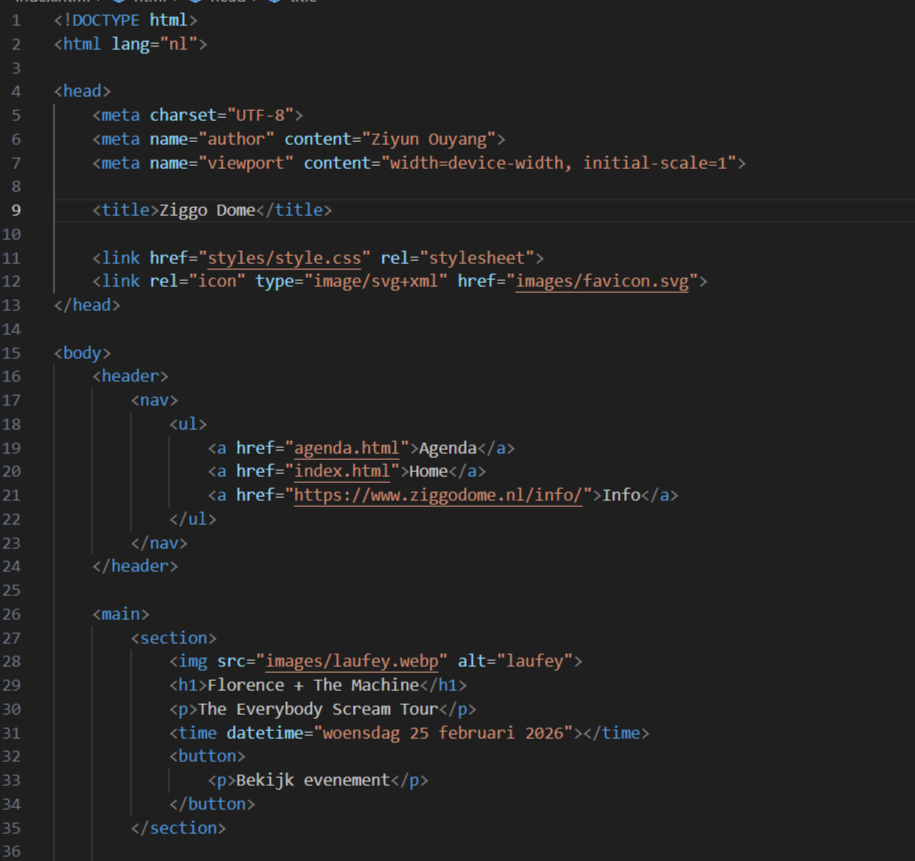
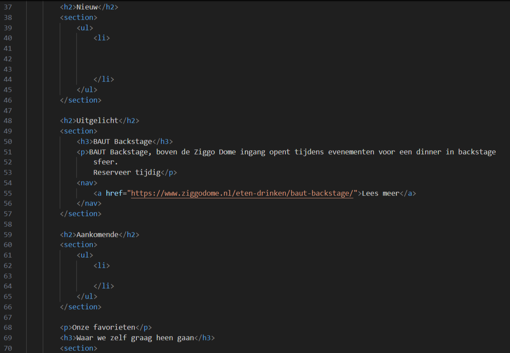
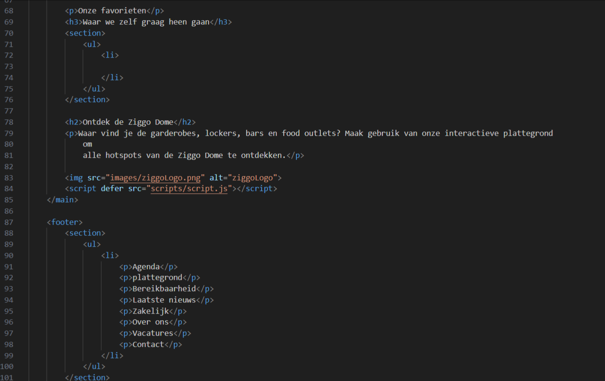
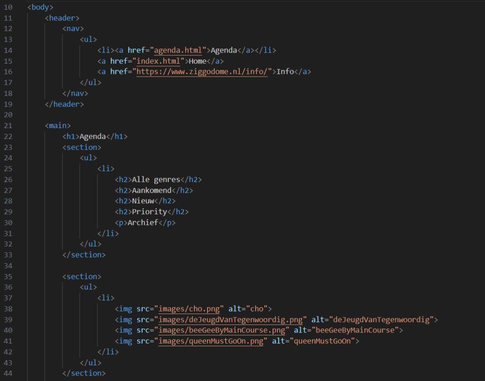

  ### Agenda voor meeting
  samen met je groepje opstellen

  | student 1      | student 2          | student 3    | student 4        |
  | ---            | ---                | ---          | ---              |
  | plaatsing van  | het groeperen van  | en ik dit    | en dan ik dat    |
  | img in een     | tekst in het       | nog een punt | dit wil ik zeker |
  | carasoul       | midden             | ...          | ...              |

  ### Verslag van meeting
  hier na afloop snel de uitkomsten van de meeting vastleggen

  - Header in de section, de section valt dan buiten header
  - punt 2
  - nog een punt
  - ...

//alt tekst artiest omschrijven //
//Header in de section zetten// V
//ss van wcag list//V

## Voortgang 2 (week 3)

  
uitwerken voor 2e voortgang

  ### Stand van zaken
  hier dit ging goed & dit was lastig (neem ook screenshots op van delen van je website en code)

  ### Agenda voor meeting
  samen met je groepje opstellen

  | student 1      | student 2          | student 3    | student 4        |
  | ---            | ---                | ---          | ---              |
  | dit bespreken  | en dit             | en ik dit    | en dan ik dat    |
  | en dat ook nog | dit als er tijd is | nog een punt | dit wil ik zeker |
  | ...            | ...                | ...          | ...              |

  ### Verslag van meeting
  hier na afloop snel de uitkomsten van de meeting vastleggen

  - punt 1
  - punt 2
  - nog een punt
- ...

## Toegankelijkheidstest 2/2 (week 4)

  
uitwerken na test in 9e werkgroep

  ### Bevindingen
  Lijst met je bevindingen die in de test naar voren kwamen (geef ook aan wat er verbeterd is):

## Voortgang 3 (week 4)

  
uitwerken voor 3e voortgang

  ### Stand van zaken
  hier dit ging goed & dit was lastig (neem ook screenshots op van delen van je website en code)

  ### Agenda voor meeting
  samen met je groepje opstellen

  | student 1      | student 2          | student 3    | student 4        |
  | ---            | ---                | ---          | ---              |
  | dit bespreken  | en dit             | en ik dit    | en dan ik dat    |
  | en dat ook nog | dit als er tijd is | nog een punt | dit wil ik zeker |
  | ...            | ...                | ...          | ...              |

  ### Verslag van meeting
  hier na afloop snel de uitkomsten van de meeting vastleggen

  - punt 1
  - punt 2
  - nog een punt
  - ...

## Eindgesprek (week 5)

  
uitwerken voor eindgesprek

  ### Je uitkomst - karakteristiek screenshots:
  

  ### Dit ging goed/Heb ik geleerd: 
  Korte omschrijving met plaatjes

  

  ### Dit was lastig/Is niet gelukt:
  Korte omschrijving met plaatjes

  

## Bronnenlijst

  
continu bijhouden terwijl je werkt

  Nb. Wees specifiek ('css-tricks' als bron is bijv. niet specifiek genoeg). 
  Nb. ChatGpT en andere AI horen er ook bij.
  Nb. Vermeld de bronnen ook in je code.

  1. bron 1
  2. bron 2
  3. ...

